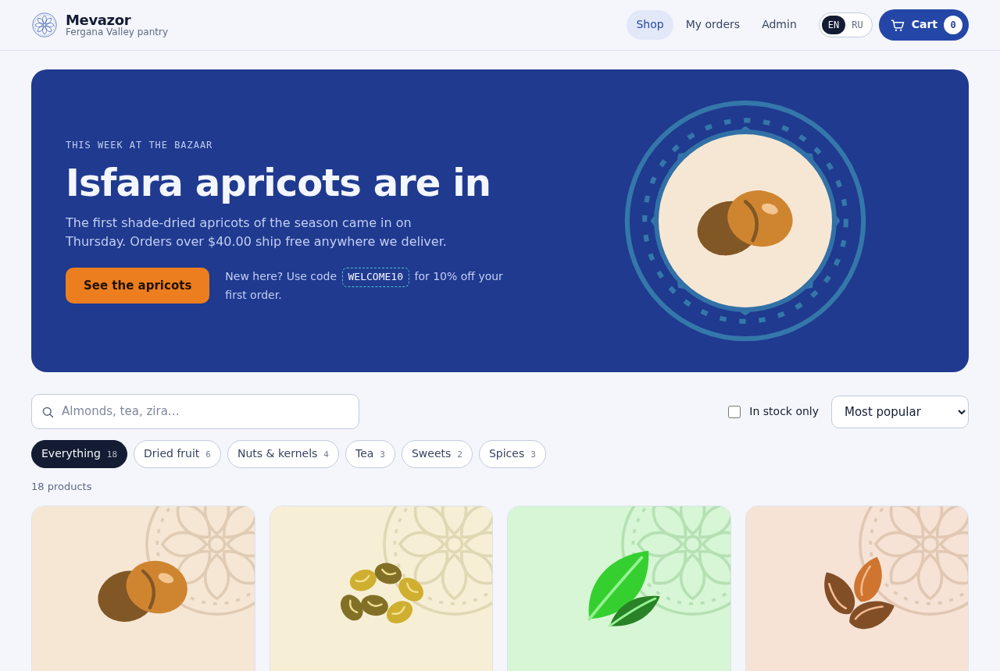
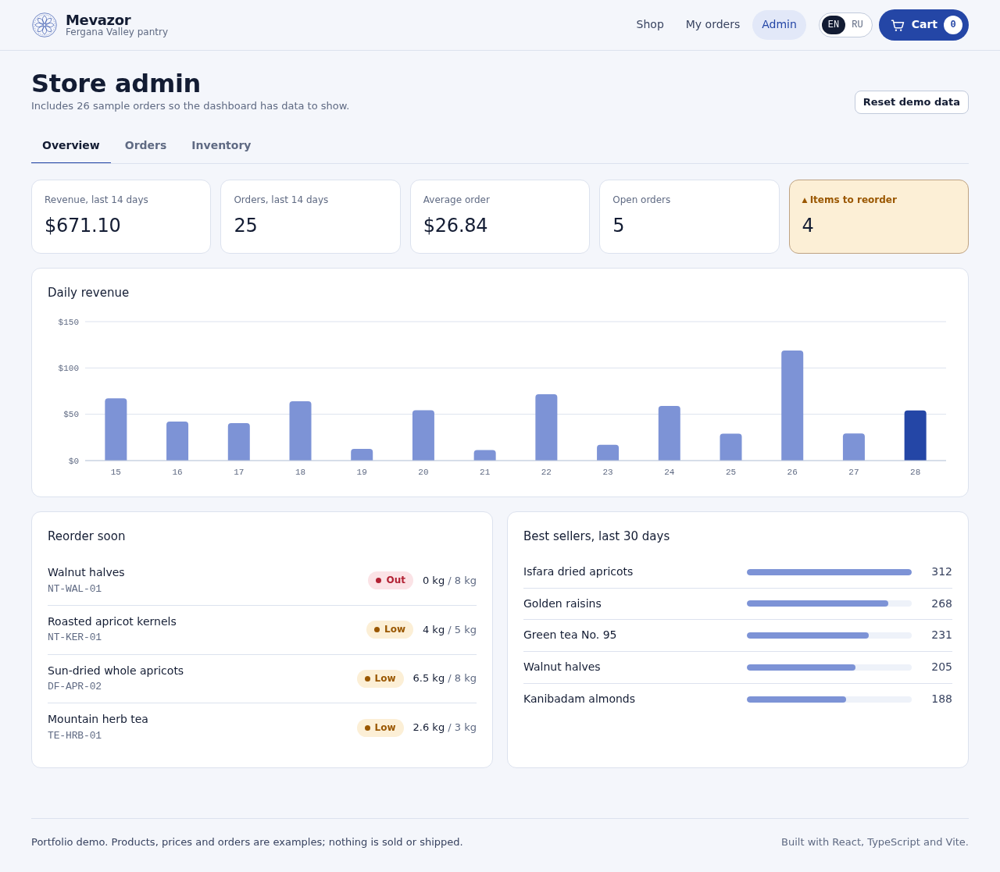

# Mevazor Store

An online store for dried fruit, nuts, tea and spices from the Fergana Valley, with a customer storefront and a store-owner admin panel. Built with **React 18, TypeScript and Vite**, no UI framework.

**Live demo:**   https://mevazor-store.netlify.app



## What it does

### For shoppers
- **Catalog** with search (English and Russian names, origin, SKU), category filters, sorting and an in-stock filter
- **Pack sizes sold by weight** (100 g, 250 g, 500 g, 1 kg) with price per kilogram on every card
- **Product details** in an accessible dialog (focus handling, Escape to close)
- **Cart drawer** with quantity controls, a free-delivery progress bar and promo codes (`WELCOME10` gives 10% off)
- **Checkout** with inline validation, courier or pickup, and cash or card on delivery
- **Order tracking**: a status tracker for every order placed in the browser
- **English / Russian** interface, switchable at any time
- **Light and dark themes** that follow the system setting

### For the store owner (`#admin`)


- **Dashboard**: revenue, order count, average order, open orders and items to reorder, plus a 14-day revenue chart with tooltips
- **Orders**: filter by status and move orders through New → Packed → On the way → Delivered, or cancel
- **Inventory**: stock in kilograms with a reorder-level meter, low-stock flags, retail value of stock, and a "receive stock" form

### Business rules
- Stock is tracked in grams of bulk product; every pack size draws from the same stock
- You can never add more to the cart than is on the shelf, and checkout re-checks stock before placing the order
- Placing an order deducts stock; cancelling it puts the goods back
- Free courier delivery from $40 after discounts; pickup is always free

## Tech

| Area | Choice |
|---|---|
| UI | React 18 with hooks, one `useReducer` store in context |
| Language | TypeScript (strict) |
| Build | Vite 5 |
| Styling | Plain CSS with design tokens and a dark theme |
| Routing | Small hash router (`#shop`, `#checkout`, `#orders`, `#admin`) |
| Persistence | `localStorage`, guarded so the app still works when storage is blocked |
| Tests | Vitest, 24 unit tests for pricing, stock and dashboard logic |

```
src/
  data/          catalog and sample orders
  lib/           pricing, formatting, stats, router (pure functions, tested)
  store/         reducer + context provider
  components/    header, product card, cart drawer, chart, etc.
  pages/         shop, checkout, orders, admin
  i18n.ts        English and Russian strings
```

## Run it locally

```bash
npm install
npm run dev        # http://localhost:5173
npm test           # unit tests
npm run build      # production build in dist/
```

`npm run build:single` produces one self-contained HTML file in `dist-single/`, handy for sending a demo.

## Deploy

The `dist/` folder is a static site. Drag it into [Netlify Drop](https://app.netlify.com/drop), or import the repo on Vercel or Cloudflare Pages with build command `npm run build` and output folder `dist`.

## What a production version would add

- A backend and database (for example Supabase or Node + PostgreSQL) so orders and stock are shared across devices
- Staff login for the admin panel
- Online payments through a payment provider
- SMS or Telegram notifications when an order changes status

## License

MIT
